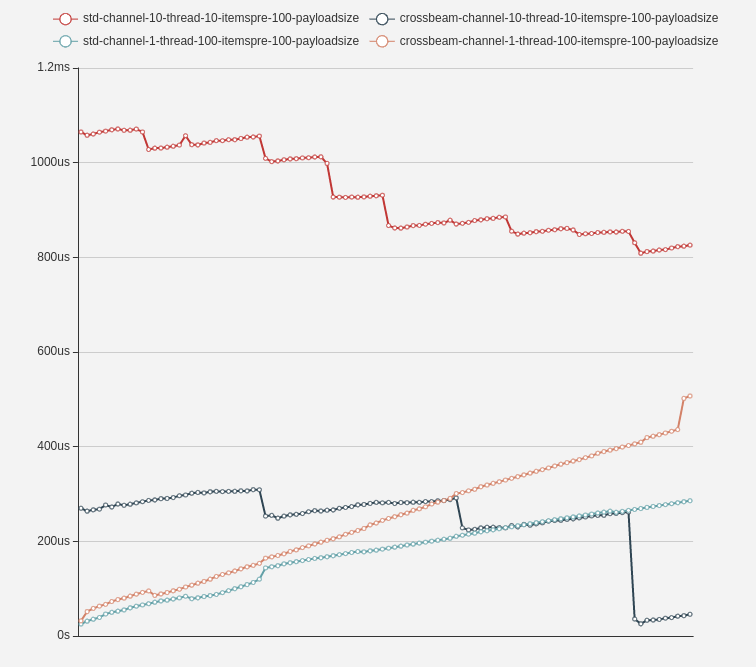

# what is 
a benchmark for channel impl in rust
# what the result like

# how to use
1. download
2. cargo run
3. copy paste the content of echarts.js to [echarts](https://www.echartsjs.com/examples/zh/editor.html?c=line-simple)